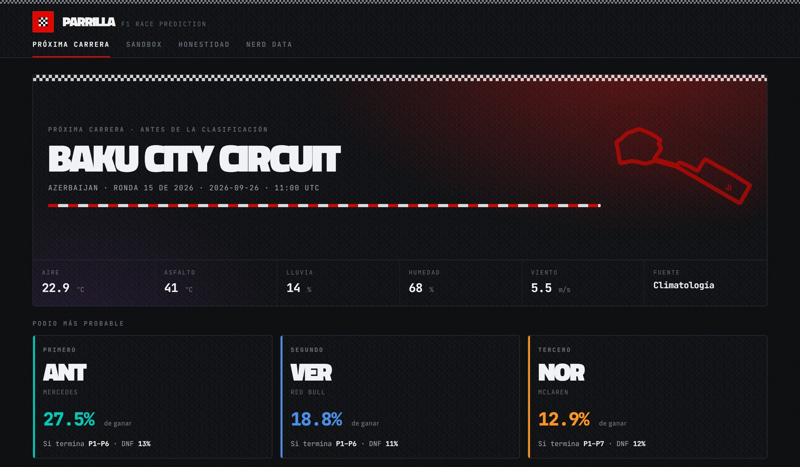
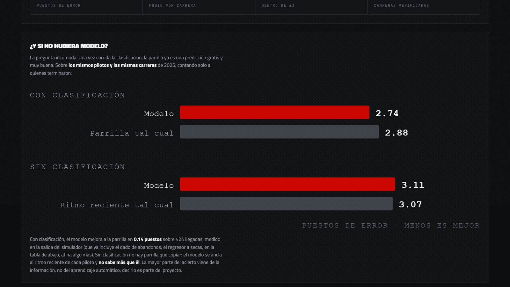

# Predicción de carreras de F1 — con un historial honesto

[](https://github.com/josemtx/f1-weather-rec-system/actions/workflows/ci.yml)
[](https://josemtx.github.io/f1-weather-rec-system/)

Predicción probabilística de carreras de Fórmula 1 — probabilidad de victoria,
podio y puntos por piloto, dónde acaba *si termina* y cuánto riesgo tiene de no
hacerlo — servida en un dashboard estático que enseña cómo de bien lo hace el
modelo frente a la alternativa más simple posible.

**Dashboard en vivo → https://josemtx.github.io/f1-weather-rec-system/**

[](https://josemtx.github.io/f1-weather-rec-system/)

## Resultados, medidos fuera de muestra

Todas las cifras salen de la temporada 2025 completa, predicha por un modelo
que nunca la vio durante el entrenamiento.

| | Error medio (puestos) | Copiando el ancla sin modelo |
|---|---|---|
| Con clasificación (ancla: la parrilla) | **2.49** | 2.88 |
| Sin clasificación (ancla: ritmo reciente) | 3.11 | 3.07 |

- Conocida la parrilla, el modelo la mejora en ~0.4 puestos y acierta 2.3 de
  los 3 pilotos del podio por carrera.
- Antes de la clasificación no sabe más que el ritmo reciente de cada piloto,
  y el dashboard lo dice tal cual.
- Los intervalos del 80 % cubren el **80.4 %** de los resultados reales:
  calibrado, no supuesto.
- Cada predicción se guarda en la base de datos *antes* de la carrera, con la
  información disponible en ese momento, y no se puede reescribir después.

[](https://josemtx.github.io/f1-weather-rec-system/)

## Cómo está hecho

```
Java · OpenF1 + OpenWeatherMap  ─┐
Python · Jolpica/Ergast          ├─►  MongoDB  ─►  81 features sin fuga  ─►  XGBoost
Python · NASA POWER + ERA5      ─┘                 (10 grupos, shift(1))      (4 objetivos)
                                                                                   │
        dashboard estático  ◄─  data.json  ◄─  simulador Monte Carlo  ◄────────────┘
        (GitHub Pages)                         clima · fiabilidad · boxes · ruido calibrado
```

| Capa | Qué hace |
|---|---|
| `java-app/` | Ingesta de sesiones, vueltas, stints, paradas y sensores de pista desde OpenF1; pronóstico diario por circuito (Task Scheduler de Windows) |
| `ml/jolpica/`, `ml/ingestion/` | Resultados, clasificación y calendario 2018–2026; clima histórico (NASA POWER, Copernicus ERA5); catálogo de circuitos |
| `ml/features/` | 92 columnas en 10 grupos; toda estadística móvil va desplazada una carrera para que nada del futuro se cuele; las "filas fantasma" hacen pasar las carreras futuras por el mismo pipeline |
| `ml/training/` | Regresor anclado a la parrilla (predice el delta, no la posición), clasificadores calibrados, backtest walk-forward, ablación por régimen de información, calibración de intervalos, diagnóstico de residuos |
| `ml/simulation/` | Monte Carlo sobre el modelo: clima, fiabilidad, jitter de boxes y ruido residual dimensionado con el error medido |
| `ml/predictions/` | Registro auditable de predicciones con su régimen de información (antes / después de la clasificación) |
| `ml/dashboard/` | Exportador a `data.json` y la página HTML sin dependencias |

Stack: Python 3.12 (pandas, XGBoost, scikit-learn, SHAP), Java 17 + Maven,
MongoDB, HTML/CSS/JS sin frameworks. 24 tests unitarios que no necesitan base
de datos.

## Decisiones que conviene conocer

- **Predecir el delta frente a un ancla, no la posición absoluta.** Medido
  antes de decidir: un regresor que predecía la posición directamente *no*
  superaba a "predecir = parrilla" (2024: 3.47 frente a 2.91). Anclarlo le da
  la vuelta.
- **Los abandonos nunca entran en el regresor.** Los tira el simulador aparte.
  Mezclarlos sesgaba a todos los finalistas un puesto entero y dejaba los
  intervalos sin sentido ("P1–P18").
- **El clima aporta ~0.02 puestos.** Con ~5 % de carreras mojadas es un techo
  de datos, no un fallo de diseño; está documentado en el dashboard, no
  escondido.
- **Las predicciones en vivo tenían un desajuste entrenamiento/inferencia** que
  el backtest no podía ver: para una carrera futura la parrilla oficial aún no
  existe y llegaba como NaN. Se encontró con un desglose SHAP y se corrigió
  rellenando con la posición de clasificación (`ml/training/anchor.py`).

Más detalle en [ml/docs/ARCHITECTURE.md](ml/docs/ARCHITECTURE.md).

<details>
<summary><b>Ejecutarlo</b></summary>

Requisitos: Python 3.11+, Java 17 + Maven, MongoDB local.

```bash
python -m venv venv && ./venv/Scripts/pip install -r ml/requirements.txt
cp .env.example .env            # MONGODB_URI, MONGODB_DB, OPENWEATHER_API_KEY, CDS_URL/CDS_KEY

# Datos
(cd java-app && mvn clean package && java -jar target/F1-WeatherRec.jar f1)
python -m ml.ingestion.load_circuits
python -m ml.jolpica.ingest_jolpica
python -m ml.ingestion.ingest_climate            # NASA POWER
python -m ml.ingestion.ingest_era5               # opcional, requiere cuenta CDS

# Modelo
python -m ml.features.build_features
python -m ml.training.train
python -m ml.training.ablation
python -m ml.training.calibrate_simulation       # y `... <version> pre_quali`

# Cada fin de semana de carrera
python -m ml.predictions.predict_race            # viernes, y otra vez tras la clasificación
python -m ml.dashboard.export_data               # regenera ml/dashboard/web/data.json
python -m pytest ml/tests -q
```

El dashboard es una página autocontenida: basta con servir `ml/dashboard/web/`
tal cual (GitHub Pages lo hace desde el workflow `dashboard` en cada push).

</details>
